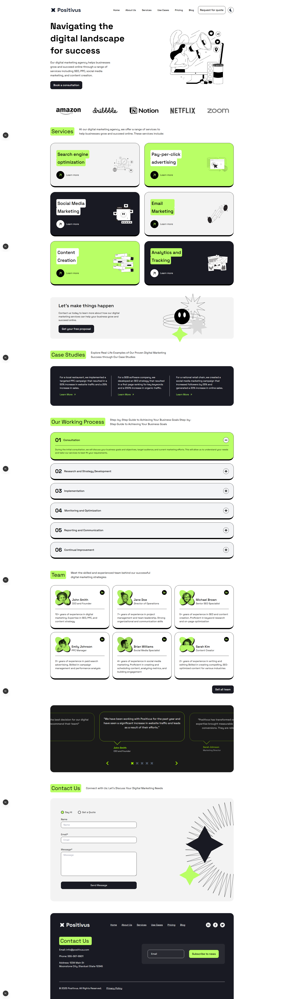

# DevAround Landing Page


A modern, responsive landing page built with Next.js and Tailwind CSS, featuring smooth animations, dark/light theme support, and optimized performance.

## 🌟 Features

- **Modern Design**: Clean and professional landing page design
- **Responsive Layout**: Fully responsive across all device sizes
- **Dark/Light Theme**: Theme switching with next-themes
- **Smooth Animations**: Enhanced UX with react-fast-marquee
- **Icon Integration**: Beautiful icons with react-icons
- **TypeScript**: Full type safety and better developer experience
- **Performance Optimized**: Built with Next.js 15 for optimal performance
- **Docker Support**: Containerized deployment ready

## 🚀 Live Demo

🔗 **[View Live Site](https://positivus-six-beige.vercel.app/)**




## 📋 Prerequisites

Before you begin, ensure you have the following installed:
- Node.js (version 22)
- npm 
- Docker (optional, for containerized deployment)

## 🛠️ Installation & Setup

### Local Development

1. **Clone the repository**
   ```bash
   git clone https://github.com/Farsit-007/Positivus.git
   cd Positivus
   ```

2. **Install dependencies**
   ```bash
   npm install
   # or
   yarn install
   ```

3. **Start the development server**
   ```bash
   npm run dev
   # or
   yarn dev
   ```

4. **Open your browser**
   Navigate to [http://localhost:3000](http://localhost:3000) to see the application.

### Production Build

```bash
# Build the application
npm run build

# Start the production server
npm start
```

## 🐳 Docker Deployment

### Quick Start with Docker

```bash
# Pull the Docker image
docker pull farsit/positivus-app:1.0

# Run the container
docker run -p 3000:3000 --rm farsit/positivus-app:1.0
```

### Building Your Own Docker Image

1. **Build the Docker image**
   ```bash
   docker build -t devaround-landing .
   ```

2. **Run the container**
   ```bash
   docker run -p 3000:3000 devaround-landing
   ```

The application will be available at `http://localhost:3000`

## 📦 Package Information

```json
{
  "name": "devaround",
  "version": "0.1.0",
  "private": true
}
```

### Dependencies

| Package | Version | Purpose |
|---------|---------|---------|
| next | 15.5.2 | React framework with SSR/SSG capabilities |
| react | 19.1.0 | UI library |
| react-dom | 19.1.0 | DOM renderer for React |
| next-themes | ^0.4.6 | Theme switching functionality |
| react-fast-marquee | ^1.6.5 | Smooth scrolling text animations |
| react-icons | ^5.5.0 | Icon library |

### Development Dependencies

| Package | Version | Purpose |
|---------|---------|---------|
| typescript | ^5 | Type checking |
| tailwindcss | ^4 | Utility-first CSS framework |
| eslint | ^9 | Code linting |
| @types/* | Various | TypeScript type definitions |

## 📝 Available Scripts

| Script | Description |
|--------|-------------|
| `npm run dev` | Start development server with hot reload |
| `npm run build` | Build the application for production |
| `npm start` | Start the production server |
| `npm run lint` | Run ESLint for code quality checks |

## 🏗️ Project Structure

```
devaround/
├── public/           # Static assets
├── src/
│   ├── app/          # Next.js app directory
│   ├── components/   # Reusable UI components
│   ├── lib/          # Utility functions
│   └── styles/       # Global styles
├── tailwind.config.js
├── next.config.js
├── package.json
├── Dockerfile
└── README.md
```

## 🎨 Theme Support

The application includes built-in dark and light theme support using `next-themes`. Users can toggle between themes using the theme switcher component.

## 🚢 Deployment

### Vercel (Recommended)

1. Push your code to GitHub
2. Connect your repository to Vercel
3. Deploy with zero configuration

### Docker Deployment

Use the provided Docker commands above for containerized deployment to any platform that supports Docker containers.

### Other Platforms

The application can be deployed to any platform that supports Node.js applications:
- Vercel
- Netlify
- Railway
- Heroku
- AWS
- DigitalOcean


## 📄 License

This project is licensed under the MIT License - see the [LICENSE](LICENSE) file for details.


## 🙏 Acknowledgments

- Built with [Next.js](https://nextjs.org/)
- Styled with [Tailwind CSS](https://tailwindcss.com/)
- Icons from [React Icons](https://react-icons.github.io/react-icons/)
- Theme support by [next-themes](https://github.com/pacocoursey/next-themes)

---

**Made with ❤️ by the Robayat Kalam Farsit**